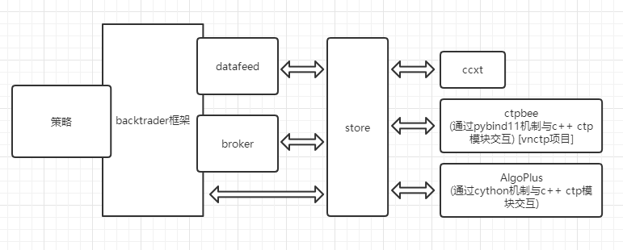

# bt_ctpbee_store

backtrader是一个非常好的开源量化回测平台,我自己也时常用它. 而[ctpbee](http://docs.ctpbee.com/)是一个很好的开源的期货CTP接口的封装,同时它也是一个基本的量化开发框架. 那么我们backtrader也可以通过ctpbee接入国内期货实盘交易.

## 基本流程图

这里要注意的是因为国内期货交易一个标的可以同时开多空两个仓位,操作也分为买入开多,买入平空,卖出开空,卖出平多四种操作,而backtrader的broker实现并不支持,所以我们这里直接绕过broker,不使用broker的任何功能,那这就意味着回测好的策略代码切换成实盘前要稍微进行一些修改:)

另外,如果想接入数字货币的实盘可参考[bt-ccxt-store-cn](https://github.com/phonegapX/bt-ccxt-store-cn)